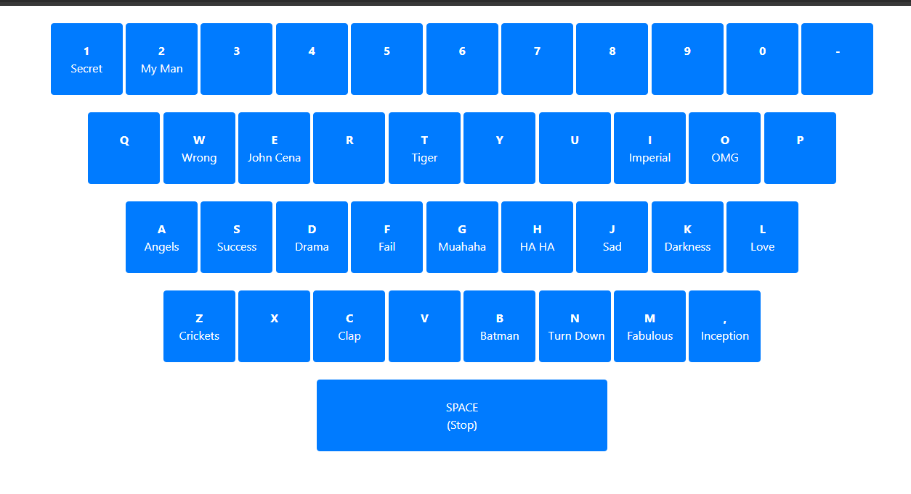
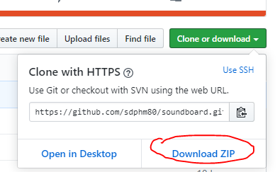
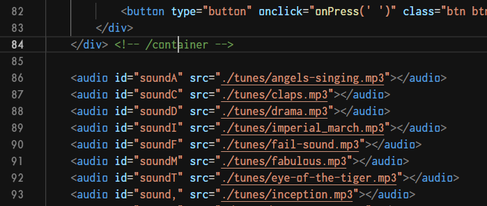

# Soundboard

Use this simple web-app to turn your computer keyboard into
a soundboard! Fun to play with, perfect for adding some sillyness
to office meetings or whatever else you can dream up.

## TRY THE DEMO

https://sdphm80.github.io/soundboard/

## TO USE OFFLINE:

1. Download the zip file
   

2. Extract ALL of the files to a folder

3. Open `index.html` in your favorite web browwser

## TO CUSTOMIZE SOUNDS

To make any changes since the sounds or other settings you'll
directly need to modify the index.html file.

1. Add any sounds samples you want to use to the "tunes" folder (MP3 is best)

2. Open the index.html and add/replace the files listed in the audio
   section below the keyboard buttons. Note the `id="sound{KEY}`. Example
   `soundA` for the letter `A` on the keyboard.

   